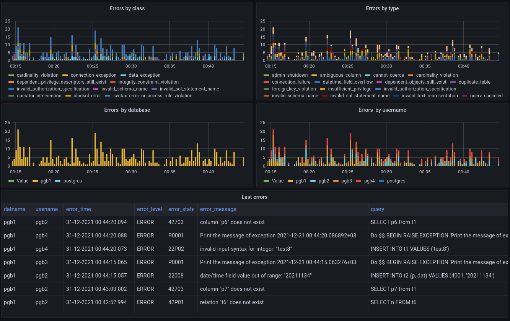

pg_stat_errors
==============

The extension gathers statistics of the error types and also shows a few last errors as is.
It can be used in monitoring systems like grafana, zabbix or any other.

Installation
------------

Compiling
~~~~~~~~~

The module can be built using the standard PGXS infrastructure. For this to work, 
the ``pg_config`` program must be available in your $PATH. Follow the installation
instruction below:::

 git clone https://github.com/akonorev/pg_stat_errors.git
 cd pg_stat_errors
 make
 make install

PostgreSQL setup
~~~~~~~~~~~~~~~~

The extension is now available. However, as it requires some shared memory to hold 
its counters, the module must be loaded at PostgreSQL startup. Thus, you must add 
the module to ``shared_preload_libraries`` in your ``postgresql.conf``. You need 
a server restart to take the change into account.

Add the following parameters into your ``postgresql.conf``::

 # postgresql.conf
 shared_preload_libraries = 'pg_stat_errors'

Once your PostgreSQL cluster is restarted, you can install the extension in each
database where you need access to the statistics::

 mydb=# CREATE EXTENSION pg_stat_errors;

Configuration
-------------

The following GUCs can be configured in ``postgresql.conf``:

- *pg_stat_errors.max* (int, default ``100``)
  
  ``pg_stat_errors.max`` is the maximum number of the error types tracked by the 
  module (i.e., the maximum number of rows in the ``pg_stat_errors`` view). If the 
  number of observed error types exceeds the pre-set number then the information 
  about the oldest error types is discarded. The number of times such information 
  was discarded can be seen in the ``pg_stat_errors_info`` view. This parameter 
  can only be set at the server start.

- *pg_stat_errors.max_last* (int, default ``20``, max ``1000``)
  
  ``pg_stat_errors.max_last`` is the maximum number of last errors tracked by the 
  module (i.e., the maximum number of rows in the ``pg_stat_errors_last`` view). 
  This parameter can only be set at the server start.

- *pg_stat_errors.save* (bool, default ``on``)
  
  ``pg_stat_errors.save`` specifies whether to save the error statistics across the 
  server shutdowns. If the value is ``off`` then statistics are not saved at the 
  shutdown nor reloaded at the server start. This parameter can only be set in the 
  ``postgresql.conf`` file or in the server command line.

Usage
-----

``pg_stat_errors`` creates several objects.

pg_stat_errors view
~~~~~~~~~~~~~~~~~~~

displays the error statistics grouped by database ID, user ID and the error code. This view
contains up to ``pg_stat_errors.max`` number of rows. The oldest records will be deallocated
and the ``dealloc`` field in the ``pg_stat_errors_info`` will be respectively increased if 
more error types are observed.

+---------------------+----------------+---------------------------------------------------+
| Name                | Type           | Description                                       |
+=====================+================+===================================================+
| userid              | oid            | User OID                                          |
+---------------------+----------------+---------------------------------------------------+
| dbid                | oid            | Database OID                                      |
+---------------------+----------------+---------------------------------------------------+
| error_level         | text           | Error level (WARNING, ERROR, FATAL and PANIC)     |
+---------------------+----------------+---------------------------------------------------+
| error_class         | text           | Error class as a two-character code               |
+---------------------+----------------+---------------------------------------------------+
| error_class_message | text           | Message of the error class                        |
+---------------------+----------------+---------------------------------------------------+
| error_state         | text           | Error state as a five-character code              |
+---------------------+----------------+---------------------------------------------------+
| error_state_message | text           | Error message                                     |
+---------------------+----------------+---------------------------------------------------+
| errors              | bigint         | Number of errors                                  |
+---------------------+----------------+---------------------------------------------------+
| last_time           | timestamp with | Time when the last error occurred                 |
|                     | time zone      |                                                   |
+---------------------+----------------+---------------------------------------------------+

dba_stat_errors view
~~~~~~~~~~~~~~~~~~~~

displays the same info as ``pg_stat_errors`` but in a human-readable form.

+---------------------+----------------+---------------------------------------------------+
| Name                | Type           | Description                                       |
+=====================+================+===================================================+
| userid              | oid            | User OID                                          |
+---------------------+----------------+---------------------------------------------------+
| usename             | name           | User name                                         |
+---------------------+----------------+---------------------------------------------------+
| dbid                | oid            | Database OID                                      |
+---------------------+----------------+---------------------------------------------------+
| datname             | name           | Database name                                     |
+---------------------+----------------+---------------------------------------------------+
| error_level         | text           | Error level (WARNING, ERROR, FATAL and PANIC)     |
+---------------------+----------------+---------------------------------------------------+
| error_class         | text           | Error class as a two-character code               |
+---------------------+----------------+---------------------------------------------------+
| error_class_message | text           | Message of the error class                        |
+---------------------+----------------+---------------------------------------------------+
| error_state         | text           | Error state as a five-character code              |
+---------------------+----------------+---------------------------------------------------+
| error_state_message | text           | Error message                                     |
+---------------------+----------------+---------------------------------------------------+
| errors              | bigint         | Number of errors                                  |
+---------------------+----------------+---------------------------------------------------+
| last_time           | timestamp with | Time when the last error occurred                 |
|                     | time zone      |                                                   |
+---------------------+----------------+---------------------------------------------------+

pg_stat_errors_last view
~~~~~~~~~~~~~~~~~~~~~~~~

displays the last errors that occured in the database. This view contains up to
``pg_stat_errors.max_last`` rows.

+---------------+----------------+-------------------------------------------------------+
| Name          | Type           | Description                                           |
+===============+================+=======================================================+
| error_time    | timestamp with | Time of occurrence of the error                       |
|               | time zone      |                                                       |
+---------------+----------------+-------------------------------------------------------+
| userid        | oid            | User OID                                              |
+---------------+----------------+-------------------------------------------------------+
| dbid          | oid            | Database OID                                          |
+---------------+----------------+-------------------------------------------------------+
| query         | text           | Text of the query                                     |
+---------------+----------------+-------------------------------------------------------+
| error_level   | text           | Error level (WARNING, ERROR, FATAL and PANIC)         |
+---------------+----------------+-------------------------------------------------------+
| error_state   | text           | Error state as a five-character code                  |
+---------------+----------------+-------------------------------------------------------+
| error_message | text           | Error message                                         |
+---------------+----------------+-------------------------------------------------------+

dba_stat_errors_last view
~~~~~~~~~~~~~~~~~~~~~~~~~

displays the same info as ``pg_stat_errors_last`` but in a human-readable form.

+---------------+----------------+-------------------------------------------------------+
| Name          | Type           | Description                                           |
+===============+================+=======================================================+
| error_time    | timestamp with | Time of occurrence of the error                       |
|               | time zone      |                                                       |
+---------------+----------------+-------------------------------------------------------+
| userid        | oid            | User OID                                              |
+---------------+----------------+-------------------------------------------------------+
| usename       | name           | User name                                             |
+---------------+----------------+-------------------------------------------------------+
| dbid          | oid            | Database OID                                          |
+---------------+----------------+-------------------------------------------------------+
| datname       | name           | Database name                                         |
+---------------+----------------+-------------------------------------------------------+
| query         | text           | Text of the query                                     |
+---------------+----------------+-------------------------------------------------------+
| error_level   | text           | Error level (WARNING, ERROR, FATAL and PANIC)         |
+---------------+----------------+-------------------------------------------------------+
| error_state   | text           | Error state as a five-character code                  |
+---------------+----------------+-------------------------------------------------------+
| error_message | text           | Error message                                         |
+---------------+----------------+-------------------------------------------------------+

pg_stat_errors_total_errors view and function
~~~~~~~~~~~~~~~~~~~~~~~~~~~~~~~~~~~~~~~~~~~~~

These objects display total number of errors. They contain only a single row and a single column::

 postgres=# select * from pg_stat_errors_total_errors ;
  pg_stat_errors_total_errors 
 -----------------------------
                           32
 (1 row)

 postgres=# select pg_stat_errors_total_errors() ;
  pg_stat_errors_total_errors 
 -----------------------------
                           32
 (1 row)

pg_stat_errors_info view
~~~~~~~~~~~~~~~~~~~~~~~~

The statistics of the ``pg_stat_errors`` module itself are tracked and can be viewed in
``pg_stat_errors_info``. This view contains only a single row.

+----------------+----------------+---------------------------------------------------------+
| Name           | Type           | Description                                             |
+================+================+=========================================================+
| dealloc        | bigint         | Total number of deallocations of the ``pg_stat_errors`` |
|                |                | entries containing info about the oldest errors.        |
|                |                | Deallocations happen if the number of observed error    |
|                |                | types exceeds ``pg_stat_error.max`` value.              |
+----------------+----------------+---------------------------------------------------------+
| stats_reset    | timestamp with | Time of the last reset of all statistics                |
|                | time zone      |                                                         |
+----------------+----------------+---------------------------------------------------------+

pg_stat_errors_reset() function
~~~~~~~~~~~~~~~~~~~~~~~~~~~~~~~

resets the statistics gathered by ``pg_stat_errors``. Can be called by superusers::

 SELECT pg_stat_errors_reset();

Examples
--------

::

 postgres=# select * from pg_stat_errors;
  userid | dbid  | error_level | error_class |             error_class_message             | error_state |      error_state_message      | errors |           last_time            
 --------+-------+-------------+-------------+---------------------------------------------+-------------+-------------------------------+-----------+--------------------------------
      10 | 13031 | ERROR       | 42          | syntax_error_or_access_rule_violation       | 42P01       | undefined_table               | 216505 | 03/08/2022 17:01:13.720858 MSK
      10 | 13031 | ERROR       | 42          | syntax_error_or_access_rule_violation       | 42883       | undefined_function            |      1 | 03/08/2022 17:18:15.281307 MSK
      10 | 13031 | FATAL       | 57          | operator_intervention                       | 57P01       | admin_shutdown                |      6 | 02/08/2022 14:40:53.716727 MSK
      10 | 13031 | ERROR       | 22          | data_exception                              | 22P02       | invalid_text_representation   | 185384 | 03/08/2022 17:01:13.720021 MSK
      10 | 13031 | ERROR       | P0          | plpgsql_error                               | P0001       | raise_exception               | 812864 | 03/08/2022 17:01:13.716421 MSK
      10 | 13031 | ERROR       | 42          | syntax_error_or_access_rule_violation       | 42703       | undefined_column              | 406142 | 03/08/2022 17:01:13.716944 MSK
      10 | 13031 | WARNING     | 01          | unknown                                     | 01000       | unknown                       | 736343 | 03/08/2022 17:01:13.71537 MSK
      10 | 13031 | ERROR       | 26          | invalid_sql_statement_name                  | 26000       | invalid_sql_statement_name    | 138501 | 03/08/2022 17:01:13.705456 MSK
      10 | 13031 | ERROR       | 42          | syntax_error_or_access_rule_violation       | 42710       | duplicate_object              |      1 | 03/08/2022 17:24:18.687203 MSK
      10 | 13031 | ERROR       | 42          | syntax_error_or_access_rule_violation       | 42P07       | duplicate_table               | 232318 | 03/08/2022 17:01:13.720615 MSK
      10 | 13031 | ERROR       | 2B          | dependent_privilege_descriptors_still_exist | 2BP01       | dependent_objects_still_exist |      1 | 03/08/2022 17:04:17.456739 MSK
 (11 rows)

::

 postgres=# SELECT * FROM dba_stat_errors;
  userid | usename  | dbid  | datname  | error_level | error_class |             error_class_message             | error_state |      error_state_message      | errors |           last_time           
 --------+----------+-------+----------+-------------+-------------+---------------------------------------------+-------------+-------------------------------+--------+-------------------------------
      10 | postgres | 13237 | postgres | ERROR       | 2B          | dependent_privilege_descriptors_still_exist | 2BP01       | dependent_objects_still_exist |      1 | 2021-12-01 14:16:11.325831+03
   16412 | pgb1     | 16459 | pgb1     | ERROR       | 23          | integrity_constraint_violation              | 23503       | foreign_key_violation         |   1499 | 2021-11-12 14:15:18.647229+03
      10 | postgres | 13237 | postgres | ERROR       | 3F          | invalid_schema_name                         | 3F000       | invalid_schema_name           |      1 | 2021-11-29 22:13:15.476547+03
   16412 | pgb1     | 16459 | pgb1     | ERROR       | 42          | syntax_error_or_access_rule_violation       | 42P01       | undefined_table               |   2030 | 2021-11-12 14:15:04.619064+03
   16412 | pgb1     | 16459 | pgb1     | FATAL       | 08          | connection_exception                        | 08006       | connection_failure            |     60 | 2021-11-19 01:56:57.103111+03
   16412 | pgb1     | 16459 | pgb1     | ERROR       | 26          | invalid_sql_statement_name                  | 26000       | invalid_sql_statement_name    |   2043 | 2021-11-12 14:15:18.67885+03
      10 | postgres | 13237 | postgres | ERROR       | 42          | syntax_error_or_access_rule_violation       | 42P01       | undefined_table               |     32 | 2021-12-01 13:49:18.950681+03
      10 | postgres | 13237 | postgres | ERROR       | 42          | syntax_error_or_access_rule_violation       | 42883       | undefined_function            |      1 | 2021-11-13 00:10:32.884677+03
      10 | postgres | 13237 | postgres | ERROR       | 42          | syntax_error_or_access_rule_violation       | 42702       | ambiguous_column              |      2 | 2021-11-13 00:59:09.900757+03
   16412 | pgb1     | 16459 | pgb1     | ERROR       | 22          | data_exception                              | 22P02       | invalid_text_representation   |   2112 | 2021-11-12 14:15:18.689152+03
   16412 | pgb1     | 16459 | pgb1     | ERROR       | 42          | syntax_error_or_access_rule_violation       | 42703       | undefined_column              |   2027 | 2021-11-12 14:15:04.630541+03
      10 | postgres | 13237 | postgres | ERROR       | 42          | syntax_error_or_access_rule_violation       | 42601       | syntax_error                  |     13 | 2021-12-01 13:51:41.061942+03
      10 | postgres | 13237 | postgres | ERROR       | 42          | syntax_error_or_access_rule_violation       | 42846       | cannot_coerce                 |      1 | 2021-11-29 22:12:50.363787+03
   16412 | pgb1     | 16459 | pgb1     | ERROR       | 23          | integrity_constraint_violation              | 23505       | unique_violation              |    415 | 2021-11-12 14:12:39.77022+03
      10 | postgres | 13237 | postgres | ERROR       | 21          | cardinality_violation                       | 21000       | cardinality_violation         |      1 | 2021-11-13 00:28:40.049738+03
      10 | postgres | 13237 | postgres | FATAL       | 57          | operator_intervention                       | 57P01       | admin_shutdown                |      3 | 2021-11-19 00:40:36.168558+03
   16412 | pgb1     | 16459 | pgb1     | ERROR       | 22          | data_exception                              | 22008       | datetime_field_overflow       |   2041 | 2021-11-12 14:15:18.673896+03
   16412 | pgb1     | 16459 | pgb1     | ERROR       | 42          | syntax_error_or_access_rule_violation       | 42501       | insufficient_privilege        |   2048 | 2021-11-12 14:15:18.668496+03
   16412 | pgb1     | 16459 | pgb1     | ERROR       | 42          | syntax_error_or_access_rule_violation       | 42P07       | duplicate_table               |   2054 | 2021-11-12 14:15:18.663046+03
      10 | postgres | 13237 | postgres | ERROR       | 57          | operator_intervention                       | 57014       | query_canceled                |    144 | 2021-11-19 03:51:06.922327+03
      10 | postgres | 13237 | postgres | ERROR       | 42          | syntax_error_or_access_rule_violation       | 42703       | undefined_column              |      6 | 2021-11-13 00:59:48.703543+03
      10 | postgres | 13237 | postgres | FATAL       | 08          | connection_exception                        | 08006       | connection_failure            |    175 | 2021-11-19 09:53:36.775614+03
 (22 rows)

::

 postgres=# select * from dba_stat_errors_last order by error_time;
           error_time           | userid | usename  | dbid  | datname  |                          query                           | error_level | error_state |                    error_message                     
 -------------------------------+--------+----------+-------+----------+----------------------------------------------------------+-------------+-------------+------------------------------------------------------
  2021-12-30 01:56:01.752414+03 |     10 | postgres | 12405 | postgres | INSERT INTO t2 (p, dat) VALUES (413, '20211139')         | ERROR       | 42703       | column "p" of relation "t2" does not exist
  2021-12-30 01:56:01.757654+03 |     10 | postgres | 12405 | postgres | DEALLOCATE pdo_stmt_0004506                              | ERROR       | 26000       | prepared statement "pdo_stmt_0004506" does not exist
  2021-12-30 01:56:01.761941+03 |     10 | postgres | 12405 | postgres | SELECT n FROM t12                                        | ERROR       | 42P01       | relation "t12" does not exist
  2021-12-30 01:56:01.766596+03 |     10 | postgres | 12405 | postgres | DEALLOCATE pdo_stmt_0007907                              | ERROR       | 26000       | prepared statement "pdo_stmt_0007907" does not exist
  2021-12-30 01:56:01.770606+03 |     10 | postgres | 12405 | postgres | INSERT INTO t2 (p, dat) VALUES (1059, '20211139')        | ERROR       | 42703       | column "p" of relation "t2" does not exist
  2021-12-30 01:56:01.775133+03 |     10 | postgres | 12405 | postgres | DEALLOCATE pdo_stmt_0002629                              | ERROR       | 26000       | prepared statement "pdo_stmt_0002629" does not exist
  2021-12-30 01:56:01.797044+03 |     10 | postgres | 12405 | postgres | INSERT INTO t2 (p, dat) VALUES (4313, '20211134')        | ERROR       | 42703       | column "p" of relation "t2" does not exist
  2021-12-30 01:56:01.802632+03 |     10 | postgres | 12405 | postgres | DEALLOCATE pdo_stmt_0004717                              | ERROR       | 26000       | prepared statement "pdo_stmt_0004717" does not exist
  2021-12-30 01:56:01.817525+03 |     10 | postgres | 12405 | postgres | SELECT p12 from t1                                       | ERROR       | 42703       | column "p12" does not exist
  2021-12-30 01:56:01.862882+03 |     10 | postgres | 12405 | postgres | INSERT INTO t2 (p, dat) VALUES (2300, '20211139')        | ERROR       | 42703       | column "p" of relation "t2" does not exist
  2021-12-30 01:56:01.868913+03 |     10 | postgres | 12405 | postgres | SELECT p8 from t1                                        | ERROR       | 42703       | column "p8" does not exist
  2021-12-30 01:56:01.874875+03 |     10 | postgres | 12405 | postgres | INSERT INTO t1 VALUES ('test6')                          | ERROR       | 22P02       | invalid input syntax for integer: "test6"
  2021-12-30 01:56:01.880706+03 |     10 | postgres | 12405 | postgres | DEALLOCATE pdo_stmt_0001192                              | ERROR       | 26000       | prepared statement "pdo_stmt_0001192" does not exist
  2021-12-30 01:56:01.884662+03 |     10 | postgres | 12405 | postgres | DEALLOCATE pdo_stmt_0001891                              | ERROR       | 26000       | prepared statement "pdo_stmt_0001891" does not exist
  2021-12-30 01:56:01.890292+03 |     10 | postgres | 12405 | postgres | INSERT INTO t2 (p, dat) VALUES (269, current_timestamp)  | ERROR       | 42703       | column "p" of relation "t2" does not exist
  2021-12-30 01:56:01.894653+03 |     10 | postgres | 12405 | postgres | INSERT INTO t2 (p, dat) VALUES (88, current_timestamp)   | ERROR       | 42703       | column "p" of relation "t2" does not exist
  2021-12-30 01:56:01.899105+03 |     10 | postgres | 12405 | postgres | CREATE TABLE t3 (n int)                                  | ERROR       | 42P07       | relation "t3" already exists
  2021-12-30 01:56:01.903823+03 |     10 | postgres | 12405 | postgres | CREATE TABLE t1 (n int)                                  | ERROR       | 42P07       | relation "t1" already exists
  2021-12-30 01:56:01.926328+03 |     10 | postgres | 12405 | postgres | INSERT INTO t2 (p, dat) VALUES (1899, current_timestamp) | ERROR       | 42703       | column "p" of relation "t2" does not exist
  2021-12-30 01:56:01.932826+03 |     10 | postgres | 12405 | postgres | INSERT INTO t1 VALUES ('test11')                         | ERROR       | 22P02       | invalid input syntax for integer: "test11"
 (20 rows)

Dashboard
~~~~~~~~~

Compatibility
-------------

``pg_stat_errors`` is compatible with the PostgreSQL 9.4, 9.5, 9.6, 10, 11, 12, 13 and 14 releases.

Authors
-------

Alexey Konorev <alexey.konorev@gmail.com>

License
-------

``pg_stat_errors`` is free software distributed under the PostgreSQL license.

Copyright (c) 2021, Alexey E. Konorev

